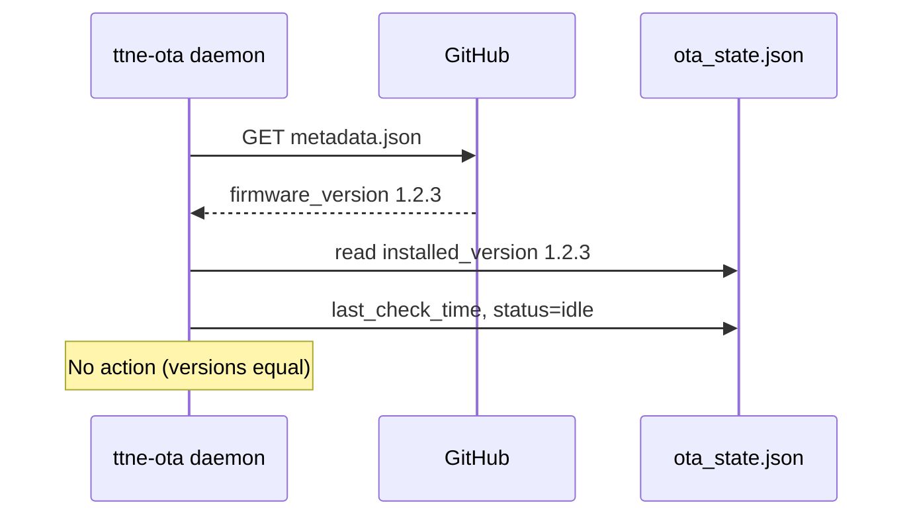
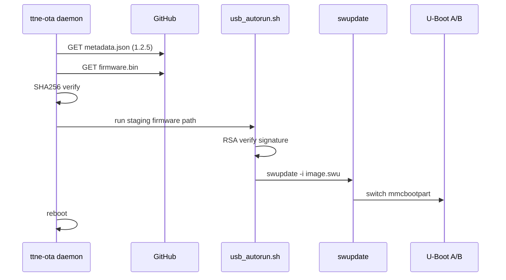
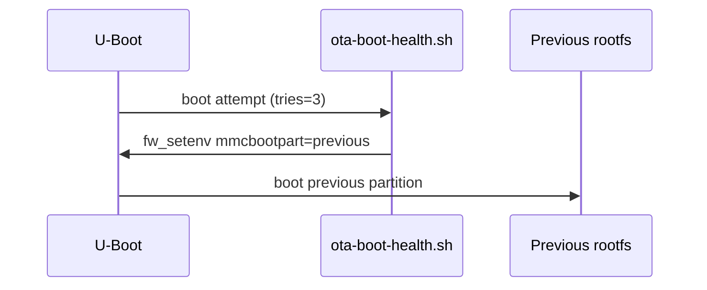

# NET-POWER PDU — Remote Firmware Update (OTA)

Over-the-air firmware updates for Variscite i.MX7 PDUs. Firmware is hosted on **GitHub**. The device checks periodically, compares semantic versions, downloads signed update images, and installs them using the existing A/B `swupdate` pipeline.

## Update channel coordination (web, USB, OTA)

Three independent update entry points share one install pipeline (`usb_autorun.sh` → `swupdate`). A coordinator prevents them from stepping on each other.

| Channel | Staging path | Session source |
|---------|--------------|----------------|
| Web UI upload | `/home/root/.ne/updates/web/firmware.bin` | `web` |
| USB stick | `ttfile.bin` on mounted USB device | `usb` |
| GitHub OTA | `/home/root/.ne/ota/downloads/firmware.bin` | `ota` |

Rules:

- Only **one** channel may stage, await confirmation, or install at a time.
- OTA **metadata checks** continue while another channel waits for user confirmation, but OTA download/install is deferred.
- `usb_autorun.sh` registers the active channel via `ttne-update-notify` at install start/end.
- Web uploads return HTTP 409 when another update is active.
- PDU display confirmation works for both web and OTA pending updates.

Session file: `/home/root/.ne/update_session.json`

## 1. System architecture

```
┌─────────────────────────────────────────────────────────────────────────┐
│                         GitHub repository / release                      │
│   metadata.json  +  firmware.bin (signed CPIO / ttfile.bin format)      │
└───────────────────────────────┬─────────────────────────────────────────┘
                                │ HTTPS (GitHub API / raw.githubusercontent.com)
                                ▼
┌─────────────────────────────────────────────────────────────────────────┐
│  ttne-ota.service  (Python daemon)                                       │
│  ├─ GitHubClient        — fetch metadata and firmware from GitHub          │
│  ├─ version_compare     — packaging.version semantic compare             │
│  ├─ SHA256 verify       — integrity before install                      │
│  └─ OtaUpdater          — orchestrates check → download → install      │
└───────────────────────────────┬─────────────────────────────────────────┘
                                │ usb_autorun.sh run <staging path>
                                ▼
┌─────────────────────────────────────────────────────────────────────────┐
│  usb_autorun.sh                                                          │
│  ├─ RSA signature verify (public.pem)                                    │
│  └─ swupdate -i image-tt-swu.swu                                         │
└───────────────────────────────┬─────────────────────────────────────────┘
                                │ A/B rootfs switch (inactive partition)
                                ▼
┌─────────────────────────────────────────────────────────────────────────┐
│  U-Boot (mmcbootpart / mmcrootpart)  +  rollback guard                  │
│  ttne-ota-health-boot.service → boot tries / rollback                    │
│  ttne-ota-health.service      → mark boot success, commit version        │
└───────────────────────────────┬─────────────────────────────────────────┘
                                │
                                ▼
┌─────────────────────────────────────────────────────────────────────────┐
│  ne-fw-api (FastAPI)  +  ne web UI                                       │
│  GET  /settings/update-status   — version, status, last check            │
│  POST /settings/ota-check-now   — manual trigger                         │
└─────────────────────────────────────────────────────────────────────────┘
```

### Components

| Component | Path / unit | Role |
|-----------|-------------|------|
| OTA daemon | `ttne-ota.service` | Periodic update checks |
| OTA library | `ttne/ota/` | GitHub client, state, updater |
| Boot guard | `ttne-ota-health-boot.service` | Rollback on failed boots |
| Boot confirm | `ttne-ota-health.service` | Mark successful boot |
| State | `/home/root/.ne/ota/ota_state.json` | Installed version, status |
| Config | `/home/root/.ne/ota_config.json` | GitHub repo, interval, token |
| Staging | `/home/root/.ne/ota/downloads/` | Downloaded firmware before verify |

## 2. GitHub integration

Set `provider` to `github_repo` or `github_releases` in `/home/root/.ne/ota_config.json`.

### Option A — Files in a repository (simplest)

Host `metadata.json` and `firmware.bin` in a repo folder:

```
your-repo/
  ota/
    metadata.json
    firmware.bin
```

Example config (`docs/examples/ota_config.json`):

```json
{
  "enabled": true,
  "provider": "github_repo",
  "check_interval_hours": 24,
  "metadata_filename": "metadata.json",
  "github_owner": "Network-Engineering-PDU",
  "github_repo": "pdu-firmware",
  "github_ref": "main",
  "github_path": "ota",
  "github_token_path": "/home/root/.ne/ota/github_token"
}
```

- **Public repo**: leave `github_token_path` empty or omit the token file; files are fetched from `raw.githubusercontent.com` over HTTPS.
- **Private repo**: create a fine-grained PAT with **Contents: Read** and save it to `github_token_path` (`chmod 600`).

### Option B — GitHub Releases

Attach `metadata.json` and `firmware.bin` to each GitHub Release. Set `"provider": "github_releases"`. The PDU downloads assets from the **latest** release.

Example: `docs/examples/ota_config.github_releases.json`

### Publishing workflow

```bash
sha256sum firmware.bin
# update metadata.json with version + hash
git add ota/metadata.json ota/firmware.bin
git commit -m "Release firmware 1.2.5"
git push

# or for releases:
gh release create v1.2.5 ota/metadata.json ota/firmware.bin
```

## 3. Metadata file structure

### Remote: `metadata.json` (in GitHub repo or release)

```json
{
  "firmware_version": "1.2.5",
  "firmware_file": "firmware.bin",
  "sha256": "a6f4d8e01234567890abcdef01234567890abcdef01234567890abcdef01234567",
  "min_compatible_version": "1.0.0",
  "release_notes": "Security fixes and outlet scheduling improvements",
  "published_at": "2026-06-01T12:00:00Z",
  "hardware_compat": ["imx7-var-som:1.0"]
}
```

| Field | Required | Description |
|-------|----------|-------------|
| `firmware_version` | yes | Semantic version of this release |
| `firmware_file` | yes | Filename alongside metadata in repo/release |
| `sha256` | yes | Lowercase hex SHA-256 of `firmware_file` |
| `min_compatible_version` | no | Refuse downgrade below this baseline |
| `release_notes` | no | Shown in web UI (future) |
| `published_at` | no | ISO-8601 publish timestamp |
| `hardware_compat` | no | SWUpdate hardware compatibility strings |

### `firmware.bin`

Must be the existing signed CPIO package (`ttfile.bin` format) consumed by `usb_autorun.sh`:

- Inner archive: `data.tar.gz` + `sign` (RSA-SHA256 over data)
- `data.tar.gz` contains `script.sh` that runs `swupdate`

### Local: `ota_state.json`

```json
{
  "installed_version": "1.2.3",
  "available_version": "1.2.5",
  "last_check_time": "2026-06-06T10:00:00Z",
  "last_update_time": "2026-06-01T08:30:00Z",
  "status": "idle",
  "last_error": "",
  "download_progress": 0
}
```

`check_interval_hours` must be `1` or `24`.

## 4. Version comparison logic

Uses Python `packaging.version.Version` (same family as PEP 440):

| Local | Remote | Action |
|-------|--------|--------|
| 1.2.3 | 1.2.5 | Update |
| 1.2.5 | 1.2.5 | No action |
| 2.0.0 | 1.2.5 | No action |
| 1.0.0 | 1.0.1 | Update |

```python
from packaging.version import Version
is_newer = Version(remote) > Version(local)
```

## 5. Linux daemon design

- **Process**: `ttne-ota` (forking daemon, PID file at `/home/root/.ne/ota/ttne-ota.pid`)
- **Loop**: sleep `check_interval_hours` → `run_check()` → repeat
- **Logging**: `~/.ne/logs/log` (shared RotatingFileHandler with `ttnedaemon`)
- **CLI**:
  - `ttne-ota start` — start daemon
  - `ttne-ota stop` — stop daemon
  - `ttne-ota check-once` — single check (debug / cron fallback)

### systemd units

```ini
# /lib/systemd/system/ttne-ota.service
[Service]
Type=forking
Environment=HOME=/home/root
ExecStart=/usr/bin/ttne-ota start
ExecStop=/usr/bin/ttne-ota stop
Restart=on-failure
```

Enable on image:

```bash
systemctl enable ttne-ota.service
systemctl enable ttne-ota-health.service
systemctl enable ttne-ota-health-boot.service
```

## 6. Implementation (Python)

Source tree:

```
ne-fw-api/ttne/ota/
  version_compare.py   # semantic version compare
  state.py             # JSON state persistence
  config.py            # ota_config.json
  github.py            # GitHub API / raw client
  remote.py            # client factory
  updater.py           # main workflow
  daemon.py            # periodic service
  boot_health.py       # post-boot success marker
```

Entry point: `ttne-ota = ttne.ota.daemon:main`

## 7. A/B partition strategy

The Variscite i.MX7 image uses dual rootfs partitions on eMMC (`mmcblk0p1` / `mmcblk0p2`). U-Boot variables:

- `mmcbootpart` — partition to boot
- `mmcrootpart` — root filesystem partition

`meta-ne/dynamic-layers/swupdate/image-tt-swu/update.sh`:

1. **preinst**: detect active partition, format inactive partition, symlink `/dev/update`
2. **postinst**: `fw_setenv mmcbootpart` / `fw_setenv mmcrootpart` to switched partition

OTA never writes the running partition; `swupdate` always targets the inactive slot.

## 8. Rollback mechanism

```
Boot N after OTA
    │
    ▼
ttne-ota-health-boot.service
    │ increment ota_boot_tries
    │ if tries >= 3 → fw_setenv mmcbootpart/mmcrootpart → previous partition → reboot
    ▼
Normal boot continues...
    │
    ▼
ttne-ota-health.service (after ttnedaemon)
    │ write boot_success marker
    │ fw_setenv ota_boot_ok 1; ota_boot_tries 0
    │ if pending_version → mark_installed()
```

If `usb_autorun` / `swupdate` fails before reboot, the active partition is unchanged and no rollback is needed.

## 9. Sequence diagrams

### Periodic check (no update)



### Update available



### Rollback on failed boot



## 10. Security recommendations

| Layer | Mechanism |
|-------|-----------|
| Transport | TLS 1.2+ to GitHub |
| Integrity | SHA-256 of firmware.bin vs metadata |
| Authenticity | RSA signature inside CPIO (`usb_autorun` / `public.pem`) |
| SWUpdate | Signed `.swu` images (extend with `swupdate -k`) |
| Credentials | GitHub PAT mode 600, Contents: Read only |
| Supply chain | Pin owner/repo/ref; optional metadata signing (future) |

### Firmware signing (production)

1. Build signed `ttfile.bin` with your existing release pipeline (`data.tar.gz` + OpenSSL sign).
2. Compute SHA-256 of the final `firmware.bin` and publish in `metadata.json`.
3. Optionally add a detached metadata signature verified before download.
4. Enable SWUpdate image signing in `sw-description` for `.swu` payloads.

### Hardening checklist

- [ ] Use a read-only GitHub token scoped to one repository
- [ ] Rotate GitHub PATs annually
- [ ] Use `check_interval_hours: 24` in production unless urgent rollout
- [ ] Monitor `ota_state.json` `last_error` via SNMP / web UI
- [ ] Keep `public.pem` in read-only rootfs
- [ ] Disable OTA on development units (`"enabled": false`)

## 11. Production deployment

1. **Image**: Ensure `python3-ttne` recipe includes OTA systemd units (Yocto `meta-ne`).
2. **First boot**: Deploy `ota_config.json` (and `github_token` for private repos) via factory provisioning.
3. **Set installed version**: `ota_state.json` `installed_version` defaults to `Config.VERSION`.
4. **Enable services**: `systemctl enable --now ttne-ota`.
5. **Publish release**: Push `firmware.bin` + `metadata.json` to GitHub.
6. **Verify**: Web UI → Settings → OTA section → "Check now".
7. **Confirm**: If `auto_update` is true in `update_config`, confirm on PDU display; else install runs immediately.

### Publishing workflow (CI)

```bash
# 1. Build signed ttfile.bin
./build_release.sh

# 2. Compute checksum
sha256sum firmware.bin | awk '{print $1}'

# 3. Generate metadata.json
# 4. Push to GitHub repo or create a release
```

## 12. Web UI integration

Settings page shows:

- Installed firmware version
- Available firmware version
- Last update check time
- Update status (`idle`, `checking`, `downloading`, `verifying`, `installing`, `pending_reboot`, `failed`, `success`)
- Manual "Check now" button

API: `GET /settings/update-status`, `POST /settings/ota-check-now`
